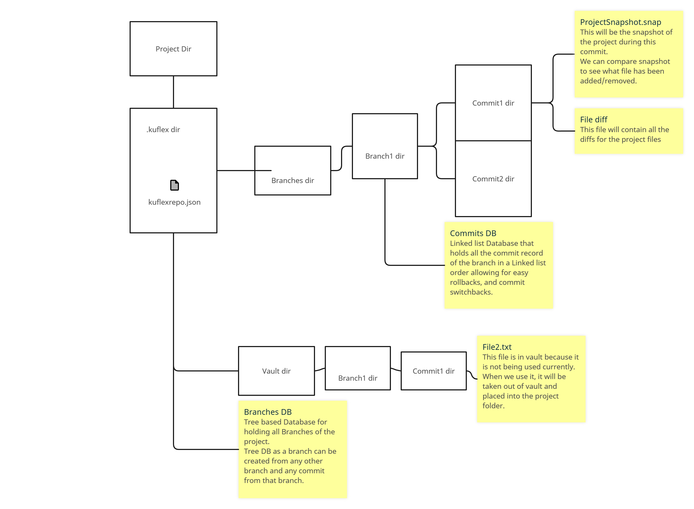

# KuFlex VCS
KuFlexVCS is a Version Control System similar to Git and other popular VCS application BUT with the added benefit of being able to use popular Cloud Storage Service (Google Drive, Mega.io, ICloud, DropBox) as your Storage Platform.

# Features
These are the features that I have planned and ready to implement. 
1. Repository System
   1. A repository holds information about the repository such as Project Name, creator, Current Commit, Current Branch, Creator etc.
   2. We will also have a way to ignore files that we do not want to be part of the repository.
2. Branches
   1. We can have multiple branches just like other VCS.
3. Commits
   1. Branches will have commits.
4. Rollbacks and switching commits
   1. We will be able to roll back changes and switch to different commits from different branches.
5. Integration with Cloud storage platform as remote Repo

Features that I will implement late into development :- <br>
1. Cloud Platform as Repository hub
2. Handling conflicts

# Structure
## Folder Structure

## Models
These models may go through changes as time goes
```
KuFlexRepo model
{
Project Name;
Creation Date;
Creator Name;
Initial Branch;
Initial Commit;
Current Branch;
Current Commit;
Rest of the details will get updated as time goes
}
```

```
Branch model
{
Name;
UID;
InheritedFrom; 
//From where was this branch created
//Which Branch and Commit did this branch out from

//When creating a new branch it needs to automatically generate an initial commit.
}
```
```
Commit model
{
Commit Name;
Commit Comment;
UID;
InheritedFrom;
//From which Commit was this inherited from.
//The inheritedFrom has to be the from the same branch.
}
```

## Architecture

.kuflex is the folder where all the files and folders are going to be found which will make the application function
properly.
It is not recommended to mess with these files and folders directly. <br> <br>

Every Branch is going to be its own folder under "branches". <br>
A Branch will have several subdirectories that are going to represent the commits done on that branch.
We keep a database record of Commits under a branch directory to keep track of commits. These record needs to be in
linked list structure so that it's easy to switch commits.
<br> <br>

A commit directory will have a snapshot of the project structure at that time as well as a file that is going to store
the File Content Diff for all the files. <br>
We will be using the snapshots between two commits to determine which file has been removed and which file has been
added.
I still need to figure out how to handle file content diff.
<br> <br>

We also have a vault system where we are going to store files that are not relevant to the currently active commit, and
once we switch to the commit where the file is relevant. <br> <br> <br>

We keep a database record of branches in tree based structure. <br>
We need tree based structure because a branch can be formed from another branch and another commit. <br> <br>

### .kuflex-> kuflexrepo.json

This is the repository that is going to have data related to the project such as project name, creation date etc.

### Branches DB
Every branch we create will be recorded into this database. A branch can be created from an existing branch and a commit within that branch.
### .kuflex->branches
Every branch is going to be its own folder whose names are going to be their UIDs.
If a project has 3 branches then we will be able to find 3 directories inside "branches" directory representing the 3 branches
### .kuflex->branches->ExampleBranch

## Instruction flow examples
### Simple Tasks

#### Initialising Repository

* Create the necessary directories and files(.kuflex, kuflexrepo.json) <br>
  Default Branch and Commit will be created later.
* Create a special branch. The reason I call it special is because it defies the normal rule of creating a branch. <br>
  A branch needs to be created from another branch and another commit but this one doesn't need them.

#### Creating Initial Special Branch

* Add new record in Branch DB
* Add new directory for the branch
* Create initial Commit <br>
  An initial Commit is going to copy all the files that are part of the project's snapshot

#### Creating Initial Commit

* Create new directory for the Commit
* Create CommitDB in the branch and add the commit
* Create ProjectSnapshot file for the commit
* File Diff WIP